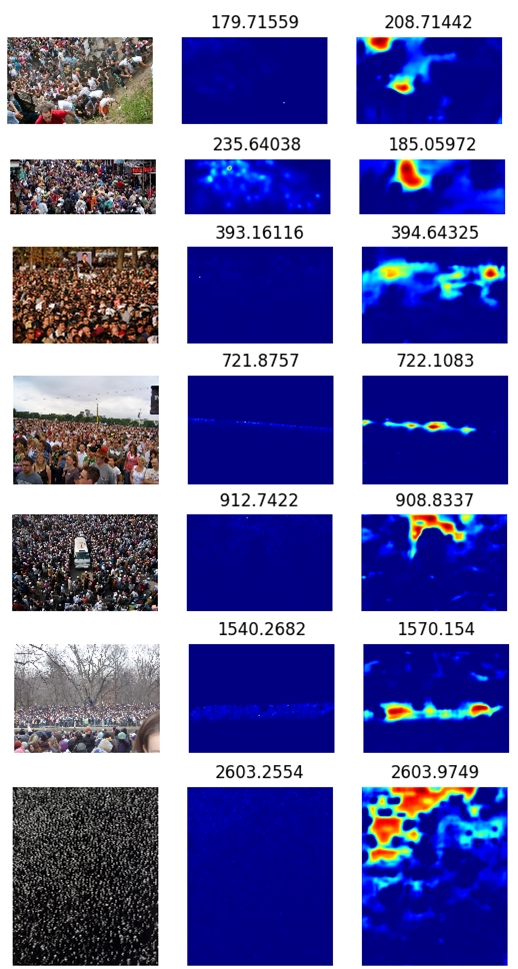

# GSA-PDC-CrowdDensity
A network structure including Global Self-Attention Module and Pyramid Dilated Convolution Module for Crowd Density Estimation  

## Getting started

- Ubuntu
- NVIDIA Telsa K80
- Pytorch 0.4.1
- Python 3.6 (Anaconda3)

```
git clone https://github.com/lcylmhlcy/GSA-PDC-CrowdDensity
cd GSA-PDC-CrowdDensity
```
## Generate Ground Truth of Crowd Density Map
Use create_json.py and create_h5.py in data_process folder to generate ground truth.  
create_json.py: convert .mat to .json  
create_h5.py: convert .json to .h5

```
cd data_process
python create_json.py
python create_h5.py
```
**Note: You have to change the dataset folder in two py files.**  

Use imgAndLabel.py to watch original image and label (gray).  
Use heatmap_lable.py to convert label (gray) to label (rgb, heatmap).  

## Usage
Use train.py to train our model.  
Use predict.py to predict density map of some image.  

```
python train.py
python predict.py
```
**Note: You have to change some parameters in two py files.**  

## Result Presentation
from left to right: **input, ground truth, predict**  
(number stands for the total person number in the image)

<p>
    
</p>
